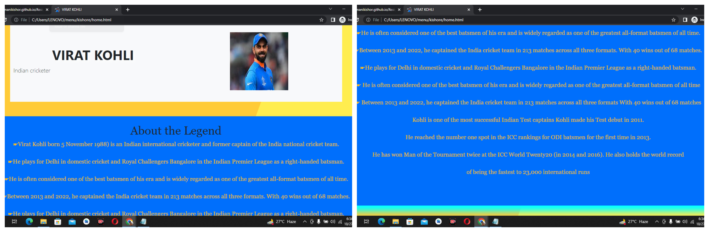

<h1 align="center">Hi I'm Mani Kishor</h1>
<h3 align="center">A passionate frontend developer from India</h3>
 
<h1>Assignment-1 HTML CSS</h1>
  
   
  <h1>Assignment-2 Bootstrap</h1>
  

  

  

  

- 🔭 I’m currently working on [Html CSS](https://manikishor.github.io/Assign-1/home.html)

- 🌱 I’m currently learning **Web Dvelopment**

- 👯 I’m looking to collaborate on **Java Script**

- 📫 How to reach me **kishorelucky809@gmail.com**

<h3 align="left">Connect with me:</h3>

<h3 align="left">Languages and Tools:</h3>

     

&nbsp;

